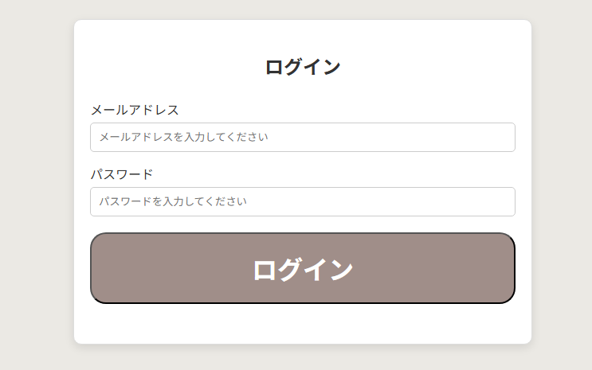
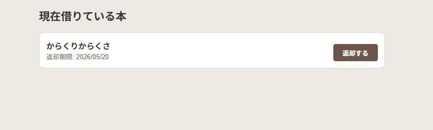
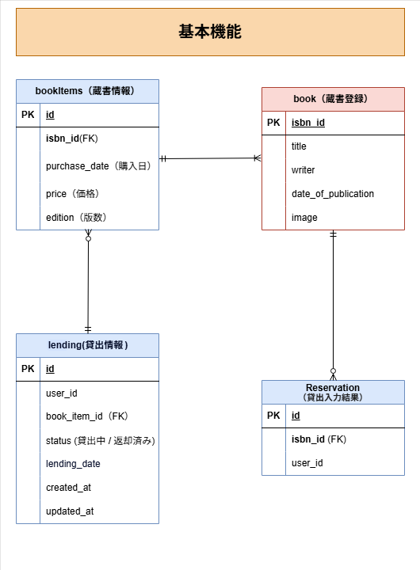
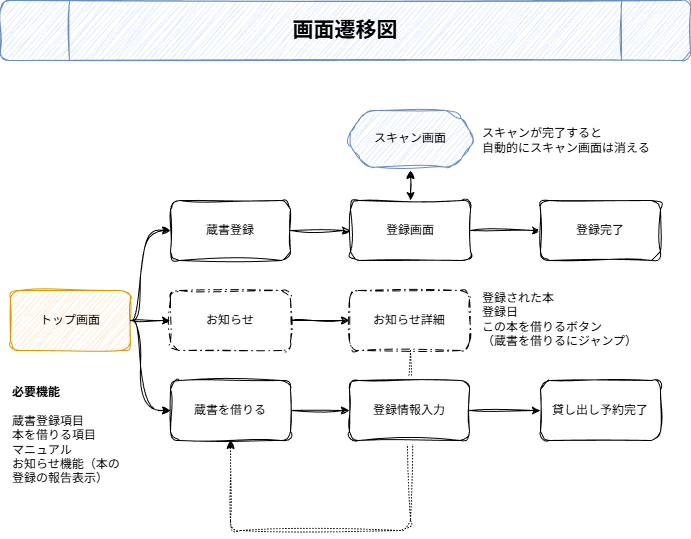
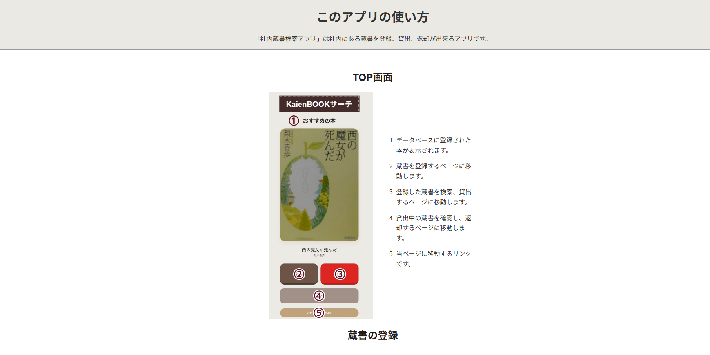

# 蔵書検索アプリ

<p align="center">
   
</p>

<p align="center">
  
  
   
</p>

---

## 概要

このアプリは、社内やコミュニティにある蔵書を効率よく管理・検索するために制作したアプリケーションです。
社内蔵書をデータベースに登録し、登録された本の検索、貸出管理、返却管理を行うことができます。
あえて「登録された本のみ」を扱うことで、特定のコミュニティに特化した図書室を実現します。

## 開発の背景
PythonとDjangoの学習成果として、実用的なウェブアプリケーションを構築するために制作しました。
※当初の設計に含まれていた「スキャン画面」は、現在開発対象外としています。

<p align="center">
  
  
</p>

### ER図


### 画面遷移図


##  特徴

- **直感的なUI**: シンプルで迷わないモダンなデザインを採用。
- **レコメンド機能**: 登録された本がランダムに表示されます。読みたい本がなければ読んでみるのがいいかもしれません。
- **ログイン機能**: ログイン機能を実装し、利用者ごとの貸出状況を管理。
- **ヘルプ機能**: 初めての人でも使い方がわかるマニュアルをアプリ内に実装しています。

**ヘルプ画面のスクリーンショット**


## 技術スタック

- **バックエンド** Python 3.13 / Django 6.0.3
- **データベース** SQLite
- **フロントエンド** HTML5 / CSS3 / JavaScript
- **ツール** venv (仮想環境), Git / GitHub 

##  使い方 (クイックスタート)

### 1.前提条件
* Python 3.13 以上がインストールされていること

### 2.インストールとセットアップ

```bash
# 1. リポジトリをクローン
git clone [https://github.com/KK0705-flower/librarys.git](https://github.com/KK0705-flower/librarys.git)
cd librarys

# 2. 仮想環境を作成して有効化
python -m venv .venv
# Windowsの場合:
.venv\Scripts\activate
# Mac/Linuxの場合:
source .venv/bin/activate

# 3. 必要なライブラリをインストール
pip install -r requirements.txt

# 4. データベースのマイグレーション
python manage.py migrate

# 5. 開発サーバーを起動
python manage.py runserver
```

### このアプリの使い方

1. 蔵書を登録する
本の背面にあるISBNコードを入力するだけで、タイトルや著者情報を自動取得して登録できます。

2. 本を探して借りる
検索: タイトルや著者名、ISBNコードなぢで蔵書を検索。
貸出: カレンダーで返却予定日を指定し、「この本を借りる」ボタンを押すことで完了します。

3. 本を返却する
「借りている本」の一覧から、返却したい本の「返却する」ボタンをクリックするだけで手続きが完了となります。
